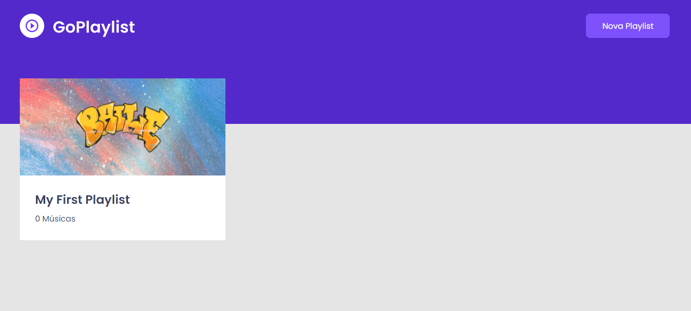

<h1>GoPlaylist</h1>




<br />

## 💻 Tecnologias

- [ReactJS](https://reactjs.org/)
- [Typescript](https://www.typescriptlang.org/)
- [React Router](https://reacttraining.com/react-router/web/guides/quick-start)
- [json-server](https://github.com/typicode/json-server)
- [Axios](https://github.com/axios/axios)
- [React Modal](https://github.com/reactjs/react-modal)
- [styled-components](https://www.styled-components.com/)
- [Figma](https://www.figma.com/file/1UYsF7yiiDlNXNgt3LgD6C/GoPlaylist?node-id=0%3A1)

<br />

## 🚀 Instalando GoPlaylist

Para instalar o GoPlaylist, siga estas etapas:
```
$ yarn install
```

<br />

## ☕ Usando GoPlaylist

Para usar GoPlaylist, siga estas etapas:
```
$ yarn start
$ yarn server
```
